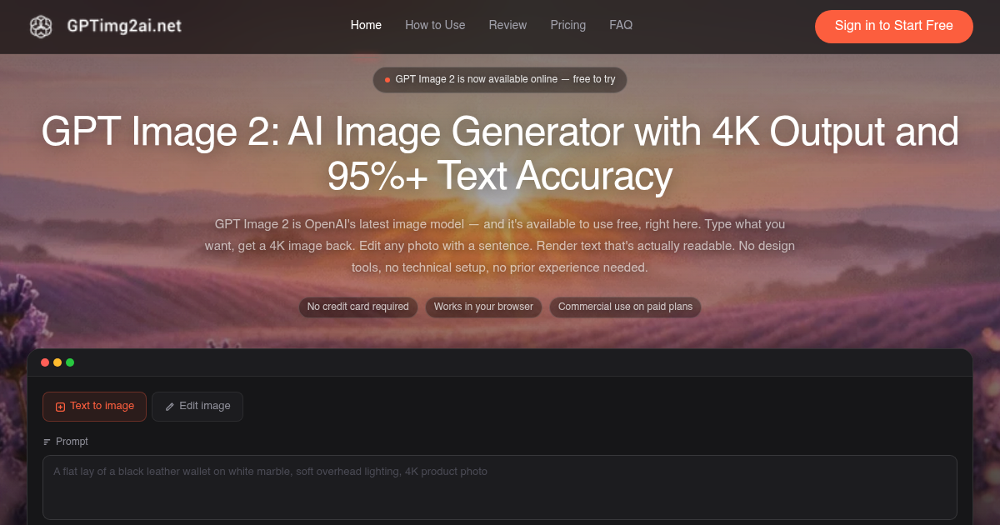

# GPT Image 2

> AI-Powered Image Generation Tool

[**GPT Image 2**](https://gptimg2ai.net/) is a powerful AI image generation tool that transforms your ideas into stunning visuals. Powered by advanced artificial intelligence, it enables users to create high-quality images from simple text descriptions.

## Features

- Text-to-Image Generation - Create images from natural language descriptions
- Fast Processing - Generate images in seconds
- High Quality Output - Produce stunning, high-resolution images
- Multiple Styles - Support for various artistic styles and formats
- Easy to Use - Simple and intuitive interface

## Getting Started

Visit [gptimg2ai.net](https://gptimg2ai.net/) to try GPT Image 2 now!

## Links

- Website: [https://gptimg2ai.net/](https://gptimg2ai.net/)

---

*Powered by GPT Image 2*
